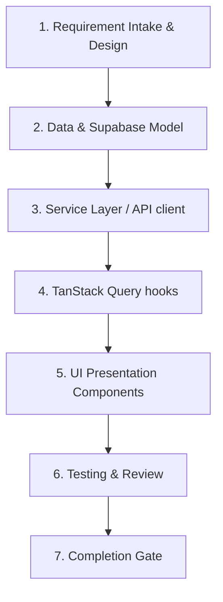

# Workflow — Feature Development

## Purpose

Defines the sequence of steps, validations, quality gates, and rollback plans required when developing a new feature for PokéVault. Guides the flow from intake and layout strategy to database configuration, API integration, TanStack Query hooks integration, UI component styling, and unit/E2E test validation.

---

## Sequence of Steps

### Step 1 — Intake & Layout Planning
- Define the feature goals, user actions, and page layout.
- Review design tokens (colors, font hierarchy, glassmorphism details).
- Choose if the view is a route page, modal overlay, or nested tab.
- *Agent responsible*: Frontend Engineer, Architect
- *Skill used*: `create-page.md`

### Step 2 — Data Modeling & Supabase Schema
- Draft SQL schemas (tables, triggers, indices).
- Ensure RLS policies are explicitly defined.
- Run `supabase gen types typescript` to update the typed client contract.
- *Agent responsible*: Data Modeler, Supabase Engineer
- *Skill used*: `create-supabase-model.md`

### Step 3 — Service Client Integration
- Build helper services or fetch wrappers with proper caching headers, rate limiting, and backoff retries.
- Map external data payloads (e.g. from Pokemon TCG API) into clean internal interfaces defined in `src/types.ts`.
- *Agent responsible*: Backend Engineer
- *Skill used*: `create-api-integration.md`

### Step 4 — TanStack Query Hooks Integration
- Extract data requests into reusable custom React hooks using `@tanstack/react-query`.
- Configure `staleTime`, caching parameters, and automatic invalidation queries.
- Build optimistic update states for immediate UI reactivity.
- *Agent responsible*: Frontend Engineer
- *Skill used*: `create-feature.md`

### Step 5 — UI Presentation Components
- Design UI matching the dark glassmorphic system.
- Build components ≤ 300 lines of code.
- Apply smooth interactive hover, perspective tilt, or radial sheen overlays using Motion.
- Ensure proper ARIA roles and keyboard navigability.
- *Agent responsible*: Frontend Engineer
- *Skill used*: `create-component.md`

### Step 6 — Testing & Quality Gates
- Write unit tests for hooks and calculations using Vitest.
- Build component interaction checks with React Testing Library.
- Run E2E tests for multi-step flows via Playwright.
- Run `npm run lint` and `tsc --noEmit`.
- *Agent responsible*: QA Engineer, Reviewer
- *Skill used*: `write-tests.md`, `review-code.md`

---

## Required Validations

- **Typesafe Check**: Zero uses of `any` types or unannotated casts in compiler logs.
- **RLS Verification**: Try to run a select or insert query without proper authorization context and ensure Supabase rejects the action.
- **Perf audit**: Ensure the UI list rendering is optimized. No O(n²) loops or missing key indices.

---

## Completion Criteria

- [ ] Features are fully implemented and function on local dev.
- [ ] Direct components do not exceed the 300-line limit.
- [ ] Database schema is migration-ready.
- [ ] Code passes lint, formatting, and unit test runner gates.
- [ ] Documentation updated in `AGENTS.md` and related architectural references.
- [ ] PR approved by at least 2 agents (Architect and Reviewer).

---

## Rollback Plan

If a feature causes database integrity issues or crashes production:
1. Revert the git commit on the release branch.
2. Rollback the database migration using Supabase CLI commands.
3. Deploy the reverted revision and verify the recovery of systems.
