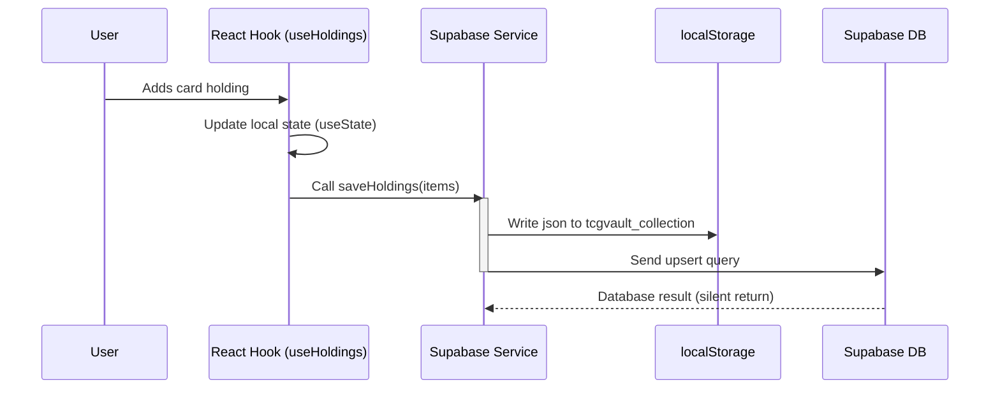
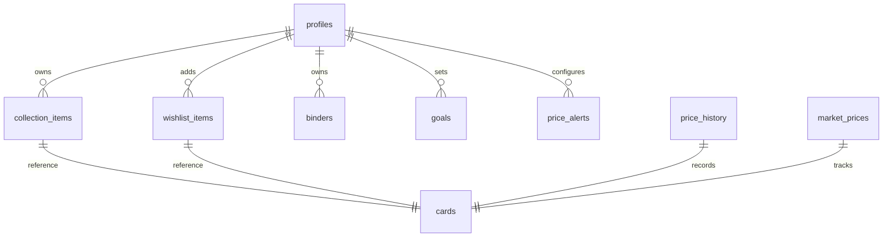

# PokéVault — Architecture Specification

This document details the software architecture of PokéVault, comparing the current prototype SPA layout with the target Next.js App Router architecture.

---

## 1. System Overview

PokéVault is a single-page application (SPA) portfolio tracker for Pokémon TCG collectors. It utilizes a client-side architecture where routing, state, and authentication are managed in the browser, with Supabase and the Pokémon TCG API acting as the backend and data layers.

---

## 2. Current Architecture (Vite SPA)

### Component Hierarchy & Routing
The root component `src/App.tsx` contains the application state and acts as the router. It listens to popstate events to toggle between views.

```
                  App.tsx (Routing + Auth Gate)
                             │
            ┌────────────────┴────────────────┐
            ▼                                 ▼
    LandingPage.tsx (Public)        MainVaultApp (Protected App Shell)
    (Home/About/Features/Auth)                │
            ┌───────────────┬─────────────────┼────────────────┬───────────────┐
            ▼               ▼                 ▼                ▼               ▼
     DashboardTab    CollectionTab       JourneyTab       TrainerLabTab    SettingsTab
```

### State & Caching Flow (Mermaid Sequence)

The diagram below details the data writing path (write-through cache pattern) in the current setup:



### Supabase Table Schema

PokéVault defines 10 core tables:



#### Table Definitions
1. **`profiles`**: `user_id` (PK, uuid), `display_name`, `avatar_url`, `bio`, `settings` (JSONB), `created_at`.
2. **`cards`**: `id` (PK, string), `name`, `supertype`, `subtypes`, `hp`, `types`, `images` (JSONB), `tcgplayer` (JSONB).
3. **`collection_items`**: `id` (PK, uuid), `user_id` (FK), `card_id` (FK), `condition`, `purchase_price`, `quantity`, `is_graded`, `grade`, `grading_company`, `cert_number`, `binder_id` (FK), `front_photo_url`, `back_photo_url`, `notes`, `created_at`.
4. **`wishlist_items`**: `id` (PK, uuid), `user_id` (FK), `card_id` (FK), `priority`, `target_price`, `notes`, `created_at`.
5. **`binders`**: `id` (PK, uuid), `user_id` (FK), `name`, `description`, `cover_card_id`, `created_at`.
6. **`goals`**: `id` (PK, uuid), `user_id` (FK), `title`, `target_value`, `type` (value/set/species), `deadline`, `created_at`.
7. **`market_prices`**: `card_id` (PK, FK), `price`, `updated_at`.
8. **`price_history`**: `id` (PK, uuid), `card_id` (FK), `price`, `source`, `recorded_at`.
9. **`price_notifications`**: `id` (PK, uuid), `user_id` (FK), `card_id` (FK), `old_price`, `new_price`, `is_read`, `created_at`.
10. **`price_alerts`**: `id` (PK, uuid), `user_id` (FK), `card_id` (FK), `target_price`, `enabled`, `created_at`.

---

## 3. Target Architecture (Next.js & TanStack Query)

To improve scalability, reliability, and security, the application will migrate to Next.js App Router and TanStack Query.

### Server Components vs Client Components
- **Server Components (Default)**: Used for route pages (`/app/collection/page.tsx`, `/app/portfolio/page.tsx`). These pages fetch data and pre-render markup on the server.
- **Client Components**: Used for interactive sections (forms, modals, interactive charts). They consume data passed from parent Server Components or query TanStack Query caches.

### Server-Side Data Flow (TanStack Query)
1. **Server Rendering**: The Server Component requests data from Supabase, dehydrates the query client state, and mounts it via `HydrationBoundary`.
2. **Client Hydration**: React hydrates the markup. The client component reads from the hydrated query client cache without triggering immediate network requests.
3. **Reactive Mutations**: When a user creates a holding:
   - Call mutation.
   - TanStack Query applies an optimistic update to the local cache.
   - Query client invalidates keys, triggering a background refetch to synchronize.

```
Client Action ──► TanStack Mutation ──► Optimistic UI update ──► Supabase DB Write
                                                                        │
                                                                 Cache Invalidation
                                                                        │
                                                                 Refetch Queries
```

### Security & API Guarding
- **Edge Middleware**: Next.js middleware guards `/app/*` paths, performing session validation server-side before serving code.
- **API Route Handlers**: Calls to the Gemini AI API and other sensitive endpoints route through `/api/*` handlers, keeping secret API keys secured.
- **RLS Enforcement**: Supabase Row-Level Security policies restrict rows based on the user's JWT context (`auth.uid()`).
